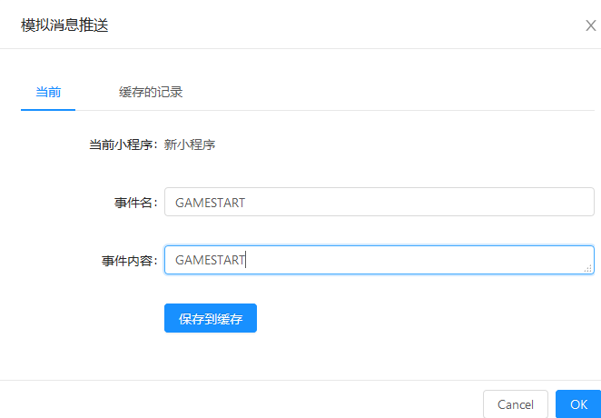

本项目是在react的官方教程[井字棋小游戏](https://github.com/Hghhhh/React-Demo-tic-tac-toe)代码上加上虎牙小程序的sdk，实现主播和观众的简单互动

# 创建小程序

到[虎牙小程序官网](https://ext.huya.com)


创建小程序，得到以下信息：

- 开发者信息：

  - **authorName**

  - **appId**
  - **appSecret**

- 小程序id

*后台开发如果想调用小程序API的话需要使用到这些信息*

# 开发

安装虎牙的[前端开发脚手架]([https://github.com/huya-ext/miniapp/wiki/%E8%84%9A%E6%89%8B%E6%9E%B6](https://github.com/huya-ext/miniapp/wiki/脚手架))

使用脚手架创建两个项目`Tic-Tac-Toe-Web`和`Tic-Tac-Toe-App`，分别选择react和react-native


## 自定义消息

自定义虎牙小程序消息，用来触发主播端和观众端的交互。

这里用到了sdk接口：

- [hyExt.observer.on](https://github.com/huya-ext/miniapp/wiki/hyExt.observer.on)：监听消息
- [hyExt.observer.emit](https://github.com/huya-ext/miniapp/wiki/hyExt.observer.emit)：主播端触发消息
- [hyExt.requestEbs](https://github.com/huya-ext/miniapp/wiki/hyExt.requestEbs):调用后台接口

和小程序API：

- [deliverRoomByProfileId](https://github.com/huya-ext/miniapp/wiki/deliverRoomByProfileId):直播间广播接口
- [deliverByProfileId](https://github.com/huya-ext/miniapp/wiki/deliverByProfileId):主播单播接口

消息：

| 消息名   | 描述                                                   | 监听端     |
| -------- | ------------------------------------------------------ | ---------- |
| ROOMOPEN | 直播间广播消息，主播开始游戏的时候触发该事件，刷新界面 | 观众       |
| POINT    | 任意一方下子的时候触发该事件，推送下子的位置           | 主播，观众 |

## Web端开发

web端包括pc主播端和web观众端，两个入口分别是`streamer.html`和`index.html`，在`streamerApp.js`和`app.js`写主播端和观众端的逻辑

**主播端主要逻辑：**

1.点击开始触发ROOMOPEN事件:

```js
<button onClick={() => this.startNotice(0)}>开始</button>
 startNotice(step) {
        this.setState({
          stepNumber: step,
          xIsNext: (step % 2) === 0,
        });
        hyExt.observer.emit('ROOMOPEN', 'ROOMOPEN');
      }  
```

2.自定义POINT事件，监听POINT事件，消息内容是观众端下子的位置:

```js
class Game extends React.Component {
    constructor(props){
        super(props);
        this.state={
            history:[{
                squares:Array(9).fill(null),
            }],
            stepNumber : 0,
            xIsNext:true,
        };
        hyExt.logger.info('开始加载');
        hyExt.observer.on('POINT', point => {
            hyExt.logger.info('point');
            this.handleClick2(point);
        });

    }
```

3.处理观众端下子的信息：

```js
handleClick2(i) {
      const history = this.state.history.slice(0,this.state.stepNumber+1);
      const current = history[history.length - 1];
      const squares = current.squares.slice();
      if (calculateWinner(squares) || squares[i]) {
          return;
      }
      squares[i] = this.state.xIsNext ? 'X' : 'O';
      this.setState({
      history: history.concat([{
          squares: squares,
      }]),
      stepNumber:history.length,
      xIsNext: !this.state.xIsNext,
      });
  }
```

4.向后台推送自己下子的位置，由后台广播下子信息给观众：

```java
handleClick(i) {
    const history = this.state.history.slice(0,this.state.stepNumber+1);
    const current = history[history.length - 1];
    const squares = current.squares.slice();
    const xIsNext = this.state.xIsNext;
    if (calculateWinner(squares) || squares[i] || xIsNext) {
        return;
    }
    squares[i] = this.state.xIsNext ? 'X' : 'O';
    this.setState({
    history: history.concat([{
        squares: squares,
    }]),
    stepNumber:history.length,
    xIsNext: !this.state.xIsNext,
    });
    //向后台发送信息
    hyExt.requestEbs({
      header: { 'x-header': 'foo' },
      host: 'www.asdasdsada.cn',
      port: 8082,
      path: '/point',
      httpMethod: 'POST',
      param: { 'x':i+""}  {/*这里必须是string类型的，不然会出现错误!!!*/}
    }).then(({ res, msg, ebsResponse: { entity, statusCode, header } }) => {
      hyExt.logger.info(statusCode)
    }).catch(err => {
      hyExt.logger.warn('调用失败', err)
    });
  }
```


**观众端主要逻辑：**

1.监听	`POINT`消息和`ROOMOPEN`消息

2.处理主播下子的信息

3.向后台推送自己下子的位置，由后台广播下子信息给观众

代码与主播端类似


### Web端开发调试

代码完成之后，运行`hyext run dev`，可以在浏览器打开`localhost:8080`和`localhost:8080/streamer.html`看到界面

#### 观众端调试

使用[开发工具](http://hyext.msstatic.com/hy-ext-comp/1.2.0/dev/index.html)调试观众端页面

页面的右边设置好小程序路径`http://localhost:8080`（**这里必须要加上http://，否则会打不开**）

如果后端做了token的验证，这里可以选择自定义token，然后让后端给一个测试token放上去。

设置好之后点击修改，刷新页面

看到新小程序，点击之后看到观众端的界面：


点击下子会弹出发送请求的界面，这里可以模拟接口返回的信息，也可以选择直接发送到EBS。


接下来模拟消息推送，推送ROOMOPEN事件：



#### 主播端调试

安装[PC端调试工具]([https://github.com/huya-ext/miniapp/wiki/PC%E5%BC%80%E5%8F%91%E8%B0%83%E8%AF%95](https://github.com/huya-ext/miniapp/wiki/PC开发调试))

同样的，配置和小程序路径和小程序Token，然后点击加载，


接下来点击消息，模拟POINT消息推送


### 提交测试

调试完毕之后，运行`hyext release`，目录下会生成一个web文件夹，打包该文件夹为zip压缩包。

回到虎牙小程序官网，进行程序测试，配置好观众端和主播端入口，上传zip文件：


提交测试，配置主播和观众白名单，白名单内的主播和观众就可以看到该小程序了。


### Web端开发过程的问题

1. 小程序API，[deliverRoomByProfileId](https://github.com/huya-ext/miniapp/wiki/deliverRoomByProfileId)直播间广播，只广播给观众，不包括主播，刚开始会以为这个广播事件会通知到主播和观众

2. PC客户端有缓存，每次修改完小程序的代码重新构建，PC端需要重启才能看到最新的版本

3. [hyExt.context.on](https://github.com/huya-ext/miniapp/wiki/hyExt.context.on)和[hyExt.observer.on](https://github.com/huya-ext/miniapp/wiki/hyExt.observer.on)的区别，一个是监听直播间的消息，一个监听是自定义的消息，但是文档里面给的例子里面都写着监听自定义消息。

4. [小程序API错误码]([https://github.com/huya-ext/miniapp/wiki/%E9%94%99%E8%AF%AF%E7%A0%81%E5%88%97%E8%A1%A8](https://github.com/huya-ext/miniapp/wiki/错误码列表))返回的错误信息有重复

5. 小程序sdk[存储](https://github.com/huya-ext/miniapp/wiki/hyExt.storage.getItem)，存储的值什么时候会失效？
6. 小程序sdk[【观众端】显示互动通道红点](https://github.com/huya-ext/miniapp/wiki/hyExt.context.showActivityBadge)的返回信息的说明有误


## App端开发

App端包括观众端App和主播的直播助手App，使用React-Native开发。只需在原来react的代码上修改一下样式和标签即可，逻辑和Web端一样。另外，使用虎牙的脚手架开发，无需安装安卓或ios的环境，直接写好代码，使用虎牙脚手架运行，然后使用开发工具扫码即可调试。

### App端调试

#### 观众端调试

1. 安装[调试App](https://github.com/huya-ext/miniapp/wiki/DownloadApp),也就是虎牙直播的开发者版本，如果手机上已经安装了虎牙直播，需要把原来的先卸载。
2. 执行`hyext run dev`执行成功后会看到一个二维码
3. 使用开发工具扫描二维码，弹出调试界面

4. 和Web端一样设置好token之后，选择使用自定义token

5. 点击下子发送请求到Ebs

   

#### 主播端调试

1. 安装虎牙直播助手
2. 执行`hyext run dev streamer`，使用直播助手扫码，弹出调试界面
3. 和观众端调试一样，设置好自定义token
4. 发送请求到Ebs


调试过程中可能遇到的问题：

1. 先保证本地的8081端口没有被占用，`hyext run dev`可以启动
2. 第一次扫码可能会出现红屏，点击重载即可
3. 可以点击远程调试，浏览器弹出调试界面，按F12在本地看到调试的信息
4. 如果遇到其他错误可以及时到[开发群]([https://github.com/huya-ext/miniapp/wiki/%E8%81%94%E7%B3%BB%E6%88%91%E4%BB%AC](https://github.com/huya-ext/miniapp/wiki/联系我们))里提问

### 提交测试

调试完毕之后，运行`hyext release`，目录下会生成一个app文件夹，将该文件夹和之前的web文件夹打包为zip压缩包。

回到虎牙小程序官网，进行程序测试，配置好观众端（App，Web）和主播端（PC,虎牙直播助手APP）入口，上传zip文件：


提交测试，配置主播和观众白名单，白名单内的主播和观众就可以看到该小程序了。


### App端开发过程的问题

1. App调试工具不太好用
2. 虎牙直播App调试工具版本过低，如果把小程序发布到线上测试，使用App调试工具访问会提示版本过低访问不了
3. App调试工具扫码第一遍可能是红屏，重载一下就好了
4. **发送Ebs请求的参数必须是string类型的，否则会出现错误**


## 后台开发

1. 配置好虎牙小程序id，开发者信息等参数

2. 拦截JWT token解析出[用户和直播间信息](https://github.com/huya-ext/miniapp/wiki/hyExt.requestEbs)

| 参数名称  | 类型   | 备注                                      |
| --------- | ------ | ----------------------------------------- |
| iat       | number | token生成时间戳（秒）                     |
| exp       | number | 过期时间戳（秒）                          |
| appId     | string | 小程序开发者appid                         |
| extId     | string | 小程序uuid                                |
| creator   | string | 创建者（token生成方：SYS平台，DEV开发者） |
| role      | string | 用户身份：U用户，P主播                    |
| profileId | string | 主播unionId                               |
| roomId    | string | 主播房间号                                |
| userId    | string | 用户unionId                               |

3. 调用小程序API，完成广播和单播消息的功能

4. 提供相关的API接口给前端调用
5. 将应用发布到服务器上
6. 配置域名解析

### 后台开发过程中的问题

1. 小程序目前只支持http而不支持https，改用http的配置
2. 使用小程序API需要申请权限，不然推送不了消息
3. 小程序线上环境可以不用配置CORS，但是如果使用调试工具调试，后台接口必须支持CORS。


